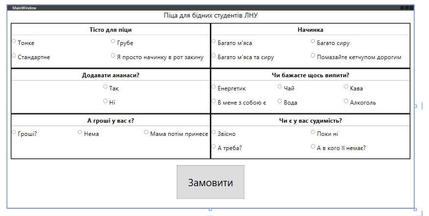

# Custom WPF Component

## Overview
This project explores the possibilities of creating custom components in WPF and includes the development of a custom visual component. Extending the standard capabilities of WPF allows for adapting components to specific software needs.

The project examines key principles of component construction, data binding mechanisms, styling and templating, and other features provided by WPF.

## Objective
The primary goal of this project is to develop a custom WPF component that extends the functionality of standard UI controls. To achieve this, the following tasks are addressed:

- Research the principles of component creation in WPF.
- Implement a custom component following modern UI development approaches.
- Ensure flexibility, design consistency, and reusability.
- Demonstrate the integration of the created component into real-world projects.

## Features
- Customizable WPF component.
- Support for data binding, styles, and templates.
- Modular and reusable design.
- Seamless integration with existing WPF applications.

## Images

